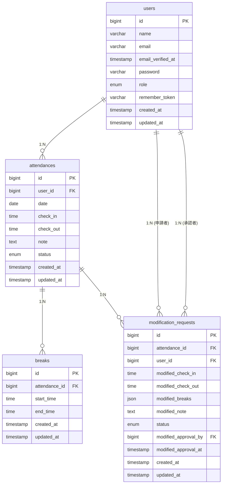

# working-management

勤怠管理Webサービス

## 環境構築

**Dockerビルド**
1. `git clone https://github.com/ezashi/working-management.git`
2. DockerDesktopアプリを立ち上げる
3. `docker-compose up -d --build`

**Laravel環境構築**
1. PHPコンテナに入る：`docker-compose exec php bash`
2. `composer install`
3. 「.env.example」ファイルから「.env」を作成し、環境環境変数を変更：`cp .env.example .env`
4. `.env`に以下の環境変数を追加
```
DB_CONNECTION=mysql
DB_HOST=mysql
DB_PORT=3306
DB_DATABASE=laravel_db
DB_USERNAME=laravel_user
DB_PASSWORD=laravel_pass
```
5. アプリケーションキーの作成：`php artisan key:generate`
6. マイグレーションの実行：`php artisan migrate`
7. シーディングの実行(データベースシーダーで作成された15人のテストユーザーが利用可能。また、各ユーザーには過去1ヶ月分の勤怠データが自動生成される。)：`php artisan db:seed`

## 使用技術(実行環境)
- PHP 8.3
- Laravel 11.45.1
- MySQL 8.0.26
- nginx 1.25
- Docker
- Docker-compose

## テーブル仕様
### users（ユーザー）
| カラム名 | データ型 | 制約 | 説明 |
|---------|---------|------|------|
| id | bigint | PK, AI | ユーザーID |
| name | varchar(255) | NOT NULL | ユーザー名 |
| email | varchar(255) | NOT NULL, UNIQUE | メールアドレス |
| email_verified_at | timestamp | NULL | メール認証日時 |
| password | varchar(255) | NOT NULL | パスワード（ハッシュ化） |
| role | enum('user', 'admin') | DEFAULT 'user' | ユーザー権限 |
| remember_token | varchar(100) | NULL | ログイン保持トークン |
| created_at | timestamp | NULL | 作成日時 |
| updated_at | timestamp | NULL | 更新日時 |

### attendances（勤怠記録）
| カラム名 | データ型 | 制約 | 説明 |
|---------|---------|------|------|
| id | bigint | PK, AI | 勤怠ID |
| user_id | bigint | FK, NOT NULL | ユーザーID |
| date | date | NOT NULL | 勤怠日付 |
| check_in | time | NULL | 出勤時間 |
| check_out | time | NULL | 退勤時間 |
| note | text | NULL | 備考 |
| status | enum | DEFAULT 'not_working' | 勤怠状態 |
| created_at | timestamp | NULL | 作成日時 |
| updated_at | timestamp | NULL | 更新日時 |

**status**: 'not_working', 'working', 'break', 'finished'

### breaks（休憩記録）
| カラム名 | データ型 | 制約 | 説明 |
|---------|---------|------|------|
| id | bigint | PK, AI | 休憩ID |
| attendance_id | bigint | FK, NOT NULL | 勤怠ID |
| start_time | time | NOT NULL | 休憩開始時間 |
| end_time | time | NULL | 休憩終了時間 |
| created_at | timestamp | NULL | 作成日時 |
| updated_at | timestamp | NULL | 更新日時 |

### modification_requests（修正申請）
| カラム名 | データ型 | 制約 | 説明 |
|---------|---------|------|------|
| id | bigint | PK, AI | 申請ID |
| attendance_id | bigint | FK, NOT NULL | 勤怠ID |
| user_id | bigint | FK, NOT NULL | 申請者ID |
| modified_check_in | time | NULL | 修正後出勤時間 |
| modified_check_out | time | NULL | 修正後退勤時間 |
| modified_breaks | json | NULL | 修正後休憩時間 |
| modified_note | text | NULL | 修正理由 |
| status | enum | DEFAULT 'pending' | 申請状態 |
| modified_approval_by | bigint | FK, NULL | 承認者ID |
| modified_approval_at | timestamp | NULL | 承認日時 |
| created_at | timestamp | NULL | 作成日時 |
| updated_at | timestamp | NULL | 更新日時 |

**status**: 'pending', 'approval'

## ER図


## URL
**開発環境**: http://localhost/

| 機能 | URL | HTTPメソッド | ユーザー |
|------|-----|-------------|------|
| ホーム | / | GET | 全て |
| ログイン画面 | /login | GET | 未認証(一般ユーザー) |
| ログイン処理 | /login | POST | 未認証(一般ユーザー) |
| 会員登録画面 | /register | GET | 未認証(一般ユーザー) |
| 会員登録処理 | /register | POST | 未認証(一般ユーザー) |
| ログアウト | /logout | POST | 一般ユーザー |
| 勤怠打刻画面 | /attendance | GET | 一般ユーザー |
| 出勤打刻 | /attendance/check-in | POST | 一般ユーザー |
| 退勤打刻 | /attendance/check-out | POST | 一般ユーザー |
| 休憩開始 | /attendance/break-start | POST | 一般ユーザー |
| 休憩終了 | /attendance/break-end | POST | 一般ユーザー |
| 勤怠一覧 | /attendance/list | GET | 一般ユーザー |
| 勤怠詳細 | /attendance/{id} | GET | 全認証ユーザー |
| 勤怠修正申請 | /attendance/{id} | PUT | 全認証ユーザー |
| 申請一覧（承認待ち） | /stamp_correction_request/list | GET | 全認証ユーザー |
| 申請一覧（承認済み） | /stamp_correction_request/approval | GET | 全認証ユーザー |
| 申請詳細（承認済み） | /stamp_correction_request/approval/{id} | GET | 全認証ユーザー |
| 管理者ログイン画面 | /admin/login | GET | 未認証(管理者ユーザー) |
| 管理者ログイン処理 | /admin/login | POST | 未認証(管理者ユーザー) |
| 管理者ログアウト | /admin/logout | POST | 管理者ユーザー |
| 日別勤怠一覧 | /admin/attendance/list | GET | 管理者ユーザー |
| スタッフ一覧 | /admin/staff/list | GET | 管理者ユーザー |
| スタッフ別勤怠一覧 | /admin/attendance/staff/{id} | GET | 管理者ユーザー |
| 修正申請承認画面 | /stamp_correction_request/approve/{id} | GET | 管理者ユーザー |
| 修正申請承認処理 | /stamp_correction_request/approve/{id} | POST | 管理者ユーザー |

## 機能一覧

### 認証機能
- **会員登録**: ユーザー名、メールアドレス、パスワードで新規登録
- **ログイン/ログアウト**: メールアドレスとパスワードによる認証
- **管理者ログイン**: 管理者専用ログイン画面

### 勤怠管理機能（一般ユーザー）
- **勤怠打刻**: 出勤・退勤・休憩開始・休憩終了の打刻
- **勤怠状態表示**: 現在の勤務状態をリアルタイム表示
- **勤怠一覧**: 月単位での個人勤怠履歴確認
- **勤怠詳細**: 個別の勤怠記録の詳細確認
- **勤怠修正申請**: 勤怠データの修正申請機能

### 申請管理機能
- **申請一覧（承認待ち）**: 承認待ちの修正申請一覧表示
- **申請一覧（承認済み）**: 承認済みの修正申請一覧表示
- **申請詳細表示**: 申請内容の詳細確認

### 管理者機能
- **日別勤怠一覧**: 全従業員の日別勤怠状況確認
- **スタッフ一覧**: 全従業員の一覧表示
- **スタッフ別勤怠履歴**: 特定従業員の月別勤怠履歴確認
- **修正申請承認**: 従業員からの修正申請の承認・却下
- **勤怠データ修正**: 管理者による勤怠データ修正

### システム機能
- **権限管理**: 一般ユーザーと管理者の権限分離
- **自動計算**: 勤務時間・休憩時間の自動計算

#### 管理者ユーザーログイン情報
- メールアドレス: admin@example.com
- パスワード: 12345678